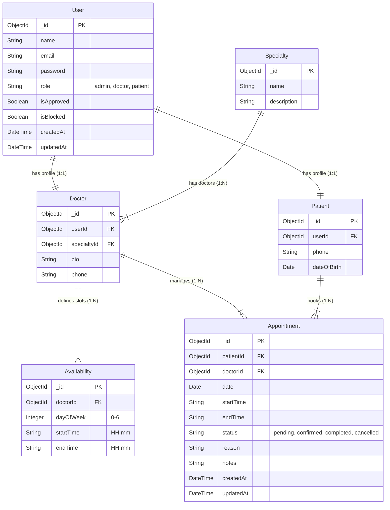

# Entity Relationship Diagram (ERD)

This document visualizes the database schema for the Medical Appointment Booking System based on the Software Requirements Specification (SRS).

## Mermaid ERD

## Schema Details

### **User**
Technically, all users (Admins, Doctors, Patients) share the `User` collection for authentication. `Doctor` and `Patient` collections store role-specific profile data linked via `userId`.

### **Relationships**
- **One User** can be **One Doctor** OR **One Patient**.
- **One Specialty** can have **Many Doctors**.
- **One Doctor** can have **Many Availability Slots**.
- **One Doctor** can have **Many Appointments**.
- **One Patient** can have **Many Appointments**.